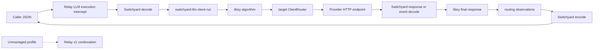

<!--
SPDX-FileCopyrightText: Copyright (c) 2026 NVIDIA CORPORATION & AFFILIATES. All rights reserved.
SPDX-License-Identifier: Apache-2.0
-->

# Switchyard NeMo Relay Dynamic Plugin

This crate builds the external `nvidia.switchyard` native plugin. It embeds
`switchyard-libsy`, drives it through `switchyard-llm-client::run`, and uses
`switchyard-llm-client` for provider HTTP calls. Managed calls use Relay's
typed asynchronous middleware API and do not require a targeted provider
continuation from Relay.

The plugin uses NeMo Relay native API v1. It depends on the small
`nemo-relay-plugin` authoring SDK, not the Relay runtime, and does not start
`switchyard-server`. Managed provider calls do not use Relay's provider
continuation.

## Ownership boundary

For a managed LLM call:

1. Relay invokes the native LLM execution intercept.
2. The plugin decodes the caller JSON through `switchyard-translation`.
3. The plugin passes the configured algorithm and its target-to-client map to
   `switchyard-llm-client::run`, using the library's public execution and
   observation boundary.
4. For every routed call, the selected target client translates the neutral
   request, applies its URL and credentials, and performs the HTTP request.
5. `switchyard-llm-client` drives libsy to its final response while the plugin
   records decisions and routing-only model usage.
6. The plugin encodes the final neutral response into the caller's protocol.

Relay still owns the outer LLM lifecycle, dynamic-plugin loading, plugin
configuration, and event substrate. Relay's downstream LLM continuation is
used only for calls whose inbound protocol is not managed by this plugin.



This boundary has two important consequences:

- Managed provider calls do not traverse Relay middleware registered after the
  Switchyard intercept and do not use the host's provider callback. Provider
  transport activity is therefore not represented as nested Relay LLM
  lifecycle events. Relay records the outer managed call and the plugin emits
  Switchyard routing marks; bridging Switchyard transport spans into Relay is
  future work. Relay's typed middleware adapter propagates the active scope so
  asynchronous routing marks retain their event parent.
- Switchyard owns provider URLs, credentials, HTTP retry behavior, and
  translation for managed calls. Relay neither validates nor transports those
  target details.

## Native API v1 and typed asynchronous execution

The manifest remains `compat.native_api = "1"`, and the plugin requires Relay
`>=0.8.0,<1.0` with native host ABI v4. It registers typed buffered and
incremental streaming intercepts through `nemo-relay-plugin`. Relay owns the plugin executor,
continuation and output-stream lifecycle, cancellation, backpressure, and
scope propagation; Relay workers therefore do not wait synchronously for
provider I/O.

The stream adapter preserves the plugin's bounded 32-message routing channel.
Relay's typed stream adapter forwards response events to its bounded output
queue and handles cancellation and backpressure. Cancelling a buffered or
streaming call drops its in-flight provider future.

Unmanaged profiles use Relay's typed continuations for pass-through. The HTTP,
routing, and translation behavior remains in Switchyard; Relay owns the native
dynamic-library boundary.

## Supported routers

The plugin supports four libsy routing modes:

- seeded, weighted `random` routing; and
- capability-based `llm_classifier` routing, where a judge selects the weak or
  strong target before the final provider call;
- escalation-mode `llm_classifier` routing, where a judge evaluates the weak
  model's completed turn and latches a session to the strong target after a
  configured confirmation streak; and
- signal-driven `stage_router` routing, with optional handoff notes, tier
  prompts, and a capability-classifier fallback for ambiguous turns.

Unsupported algorithm kinds are rejected instead of being approximated.

## Compatibility Matrix

The following matrix describes the algorithm behavior implemented by the
plugin. `Conditional` means that the feature is implemented with the constraint
shown in the table; it does not mean that the feature falls back to a different
algorithm.

| Compatibility Area | `random` | `llm_classifier` (`capability`) | `llm_classifier` (`escalation`) | `stage_router` |
|---|---|---|---|---|
| Version-2 configuration and static validation | Supported | Supported | Supported | Supported |
| Caller protocols | OpenAI Chat, OpenAI Responses, Anthropic Messages | OpenAI Chat, OpenAI Responses, Anthropic Messages | OpenAI Chat, OpenAI Responses, Anthropic Messages | OpenAI Chat, OpenAI Responses, Anthropic Messages |
| Serving-target protocols | OpenAI Chat, OpenAI Responses, Anthropic Messages | OpenAI Chat, OpenAI Responses, Anthropic Messages | OpenAI Chat, OpenAI Responses, Anthropic Messages | OpenAI Chat, OpenAI Responses, Anthropic Messages |
| Structured-output judge protocols | Not applicable | OpenAI Chat or OpenAI Responses | OpenAI Chat or OpenAI Responses | OpenAI Chat or OpenAI Responses for the optional classifier |
| Buffered responses | Supported | Supported | Supported | Supported |
| Streaming responses | Supported | Supported after the judge selects a target | Conditional: an unlatched weak stream is aggregated before the judge runs | Supported after the signal cascade selects a target |
| Retained routing state | No selection affinity; context-overflow eviction can use session identity | Optional session affinity and message-hash fallback | Confirmation streak and strong latch require stable session identity | No classifier affinity; context-overflow eviction can use session identity |
| Router-specific prompts | Not applicable | Optional judge prompt | Optional escalation-judge prompt | Optional tier prompts, handoff notes, and classifier prompt |
| Relay decision marks | Algorithm, attempt, selected target, and identity | Algorithm, attempt, selected target, and identity | Algorithm, attempt, selected target, and identity | Algorithm, attempt, selected target, and identity |
| ATOF routing-LLM usage | Not applicable unless a failed candidate is replaced | Judge calls, plus failed candidates | Judge calls and discarded weak candidates | Optional classifier judge calls, plus failed candidates |

Anthropic Messages is supported for callers and serving targets, but not for a
structured-output judge. That restriction is intentional and fails during
static configuration loading. Same-protocol streaming preserves parsed provider
events when the router does not aggregate or replace them; raw SSE bytes and
framing are not part of the compatibility contract.

### Known issue: OpenAI Responses structured-output judges

OpenAI Responses targets are accepted for structured-output judges, but the
shared Responses request encoder currently emits the Chat-compatible JSON
Schema object directly under `text.format`. This places `name`, `schema`, and
`strict` under `text.format.json_schema`; conforming Responses endpoints expect
those fields directly under `text.format`. InferenceHub therefore returns HTTP
400 with `Missing required parameter: 'text.format.name'`, and the affected
router follows its existing judge-failure or fall-open path.

OpenAI Responses remains supported as a caller and ordinary serving-target
protocol. Until the shared `switchyard-translation` encoder is corrected,
configure structured-output judges with `protocol = "openai_chat"`. Follow-up
work must add the inverse of the existing Responses-to-neutral schema conversion
plus core and process-level regression coverage for all three affected router
paths.

Managed inner provider calls also do not re-enter Relay's downstream provider
middleware. This behavior is part of the current ownership boundary, not an
automatic compatibility fallback.

Each completed routing-only model call emits a
`switchyard.routing.llm_call` ATOF mark. Its data identifies the algorithm,
attempt, call order, target, routing role, outcome,
latency, and normalized provider token `usage`. The
successful call that serves the caller is deliberately excluded because
Relay's outer LLM end event already records that usage. A failed call, or a
provider response that omits usage, has `usage = null`. Consumers can therefore
add these marks to the outer LLM usage to measure total request compute without
double-counting the serving model.

`switchyard-llm-client` owns provider retries. Every target, including the
trusted fallback target, uses its default of two additional attempts for
transient provider failures and honors capped `Retry-After` delays. A retry
stays on the selected target and does not rerun the routing algorithm. A random
target with `weight = 0` is fallback-only and is not considered by the
algorithm. Trusted fallback is attempted at most once and, for streaming
responses, only before the first caller event is emitted.

## Translation and stream fidelity

`switchyard-translation` is the only request, response, and event translation
layer. It decodes caller JSON into Switchyard's neutral protocol, encodes each
selected call for the target protocol, decodes provider results, and encodes
`ReturnToAgent` back to the caller protocol. Relay codecs are not used.

The streaming contract carries each parsed provider JSON event in a preservation
envelope alongside its normalized `LlmResponseChunk` representation.
Same-protocol routes replay the preserved JSON unchanged, including
provider-specific fields; this preserves parsed events, not raw SSE bytes or
framing. Cross-protocol routes encode only normalized chunks, and the streaming
helpers still do not expose the buffered translation engine's reject-lossy
diagnostics, so unsupported fields may be normalized or omitted. Replacing
normalized stream content or folding a stream into an aggregate drops the
per-event preservation envelope.

## Configuration

The manifest declares `compat.native_api = "1"` and Relay `>=0.8.0,<1.0`.
The manifest API value selects Relay's native plugin contract; the binary uses
Relay 0.8's typed middleware API and native host ABI v4. Rebuild the bundle
when changing SDK versions rather than assuming Rust dynamic-library
compatibility from the manifest value alone.

A Relay project can configure a seeded weighted-random router as follows:

```toml
version = 1

[[plugins.dynamic]]
manifest = "/opt/switchyard-relay-plugin/relay-plugin.toml"

[plugins.dynamic.config]
version = 2
priority = 0
[plugins.dynamic.config.algorithm]
kind = "random"
seed = 42

[plugins.dynamic.config.default_targets]
openai_chat = "fast"

[plugins.dynamic.config.targets.fast]
model = "provider/model"
protocol = "openai_chat"
endpoint = "/v1/chat/completions"
base_url = "https://provider.example.com"
weight = 1
drop_caller_extra_body = true

[plugins.dynamic.config.targets.fast.header_env]
authorization = "PROVIDER_AUTHORIZATION"
```

Target map keys such as `fast` are stable semantic names visible to libsy. The
target binding is authoritative for the provider model, protocol, endpoint,
base URL, weight, and environment-backed headers. Each `default_targets` key
both enables that inbound protocol and names its trusted fallback.

`header_env` is the only custom provider-header source. It resolves values in
the plugin process at registration time so literal header values never appear
in configuration. Environment values must not appear in errors, routing marks,
spans, or debug output. The plugin does not inherit caller credentials for
managed calls. Each variable supplies the complete header value, so an
`authorization` value must include its scheme, such as `Bearer`. Literal
`headers` configuration is rejected; non-secret routing or tenancy headers must
also use `header_env`.

Relay may intercept an OpenAI SDK call before the SDK materializes its
`extra_body` option into a provider request. Targets that reject this
caller-specific wrapper can set `drop_caller_extra_body = true`. The plugin
then drops the wrapper and its contents; it does not promote those values to
top-level provider fields. The default is `false` so lossless same-format
forwarding remains unchanged for targets that consume the extension.

`extra_body` supplies non-secret provider defaults for a target. It is useful
for provider-specific controls such as disabling reasoning on a dedicated
judge model. Fields already present on the caller's request take precedence.
Do not put credentials in `extra_body`; use `header_env` for secrets.

For `kind = "llm_classifier"`, the classifier target must use `openai_chat` or
`openai_responses`; libsy's judge request uses a JSON-schema response format
that cannot be represented losslessly by Anthropic Messages. Omitting `mode`
selects `capability`, preserving the original version-2 configuration shape.

Escalation mode evaluates the weak model's completed response before returning
it or replacing it with a strong-model response:

```toml
[plugins.dynamic.config.algorithm]
kind = "llm_classifier"
mode = "escalation"
classifier_target = "judge"
weak_target = "weak"
strong_target = "strong"
prompt = "Judge whether the weak model is stuck."
max_output_tokens = 512

[plugins.dynamic.config.algorithm.escalation]
confirmations = 2
recent_turn_window = 28
window_message_chars = 500
```

`judge`, `weak`, and `strong` are keys in
`plugins.dynamic.config.targets`, configured with the same model, protocol,
URL, and `header_env` fields shown above. The judge must use `openai_chat` or
`openai_responses`; the serving targets may use any supported protocol.

Use a dedicated, non-reasoning model for the judge when possible. Providers
that expose a reasoning switch can configure it on that target, for example:

```toml
[plugins.dynamic.config.targets.judge]
model = "provider/non-reasoning-judge"
protocol = "openai_chat"
base_url = "https://provider.example.com"
extra_body = { think = false }
```

The packaged escalation rubric is intentionally detailed and can consume
roughly two thousand or more input tokens depending on the tokenizer. Every
unlatched request also pays for a complete judge call. A custom `prompt` can
reduce that cost, but should be evaluated against representative trajectories
before deployment. Reasoning models may spend `max_output_tokens` on hidden or
visible reasoning before returning the structured verdict; disable reasoning
with provider-supported `extra_body` controls or raise the cap after measuring.

An unlatched streaming escalation request is intentionally buffered. Libsy must
read the complete weak response before asking the judge, so caller first-token
delivery waits for the weak call and judge verdict. A declined escalation is
reconstructed as a stream from the aggregate response, which drops the
provider-event preservation envelope. A confirmed escalation discards that
weak response and serves the strong target.

The default `confirmations = 2` retains a streak per Switchyard session. Callers
must send a stable `x-switchyard-session-id` header for the streak and strong
latch to survive across turns. Without session identity each request has
isolated state and a multi-confirmation escalation cannot latch.

A full stage router can combine tool-result signals, model-specific prompts,
handoff notes, and an optional judge for ambiguous turns:

```toml
[plugins.dynamic.config.algorithm]
kind = "stage_router"
capable_target = "strong"
efficient_target = "weak"
picker = "efficient_first"
confidence_threshold = 0.5
recent_turn_window = 3
capable_system_prompt = "Diagnose before editing."
efficient_system_prompt = "Follow the settled plan."

[plugins.dynamic.config.algorithm.handoff_notes]
escalation_note = "The previous model was stalling; pick up the diagnosis."
deescalation_note = "The task is settled; continue with the mechanical work."
only_on_wrong_signal_escalation = true

[plugins.dynamic.config.algorithm.classifier]
target = "judge"
base_threshold = 0.5
threshold_step = 0.1
recent_turn_window = 3
prompt = "Estimate whether the efficient target can finish this turn."
max_output_tokens = 512
```

Stage routing reads normalized tool calls and tool results from OpenAI Chat,
OpenAI Responses, and Anthropic Messages traffic. When the signals do not cross
`confidence_threshold`, the optional classifier decides; if it is absent or
cannot decide, the configured picker's default tier serves the turn. The
classifier target has the same structured-output protocol restriction as the
standalone classifier.

Ambiguous turns that reach the optional classifier add one judge call;
decisive tool signals do not. Decision marks report the selected model from
libsy's `RoutingOutcome`.

Version-1 service configuration, decision-only execution, and observe-only
mode are rejected.

## Build and bundle

The crate is a non-publishable member of the Switchyard Cargo workspace.
Operators install a binary bundle rather than a Rust crate:

```bash
cargo build --release \
  --manifest-path crates/switchyard-nemo-relay-plugin/Cargo.toml
python3 crates/switchyard-nemo-relay-plugin/scripts/package_bundle.py \
  --library target/release/libswitchyard_nemo_relay_plugin.so \
  --output build/switchyard-nemo-relay-plugin-linux-x86_64 \
  --archive dist/switchyard-nemo-relay-plugin-0.2.0-linux-x86_64.tar.gz
```

On macOS the library suffix is `.dylib`; Windows builds use `.dll`. The bundle
builder creates the Relay package: the shared library, a materialized manifest
with Relay's inline SHA-256 integrity digest, the JSON schema, and the project
license files. Use `.tar.gz` archives on Linux and macOS and `.zip` on Windows.
The archive's top-level directory is always `switchyard-nemo-relay-plugin`.

The release archive convention is
`switchyard-nemo-relay-plugin-<version>-<platform>.<format>`. A future Actions
matrix should upload each archive under the artifact name
`switchyard-nemo-relay-plugin-<platform>`, matching Switchyard's existing
platform-qualified artifact convention.

Install the materialized bundle with Relay's normal lifecycle commands:

```bash
nemo-relay plugins validate /opt/switchyard-relay-plugin/relay-plugin.toml
nemo-relay plugins add /opt/switchyard-relay-plugin/relay-plugin.toml
nemo-relay plugins enable nvidia.switchyard
nemo-relay plugins inspect nvidia.switchyard
```
